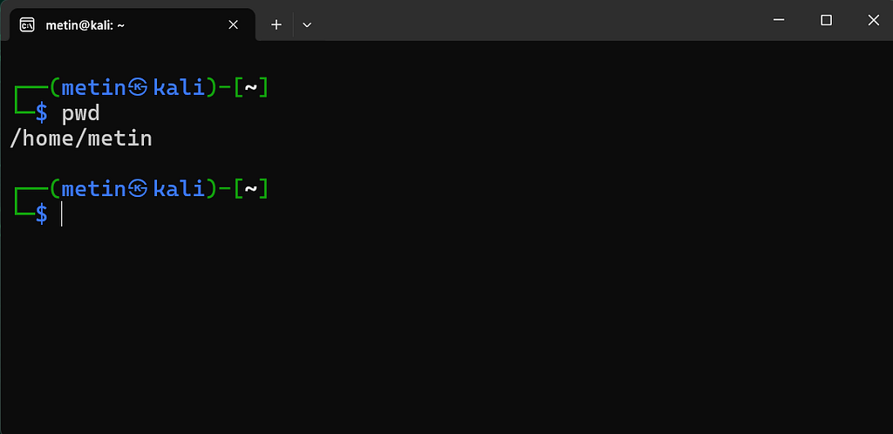
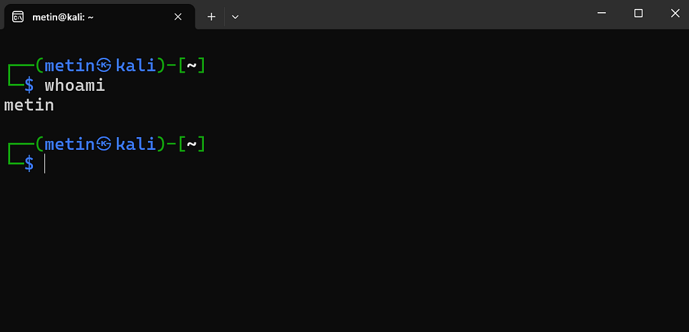
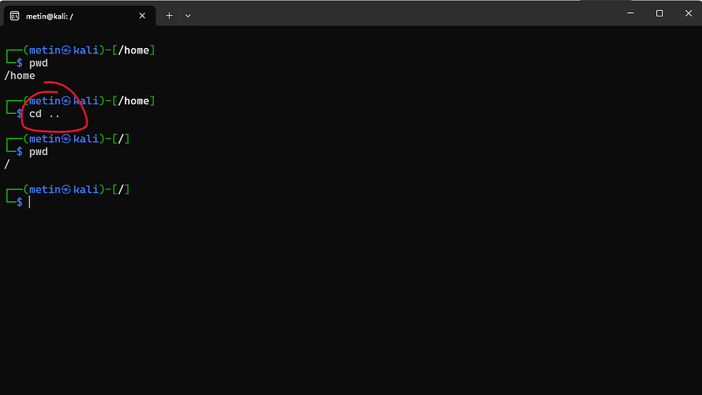
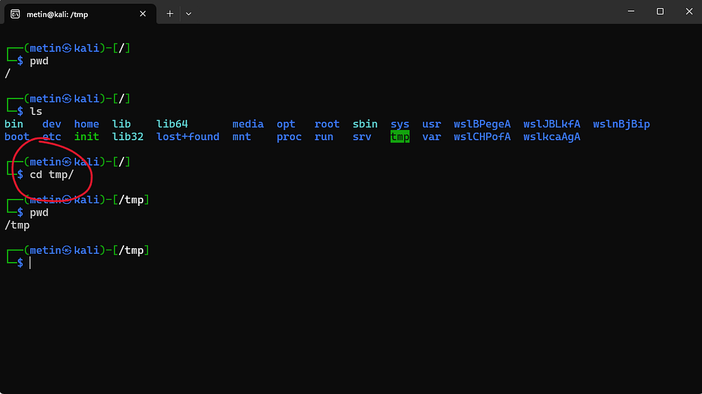
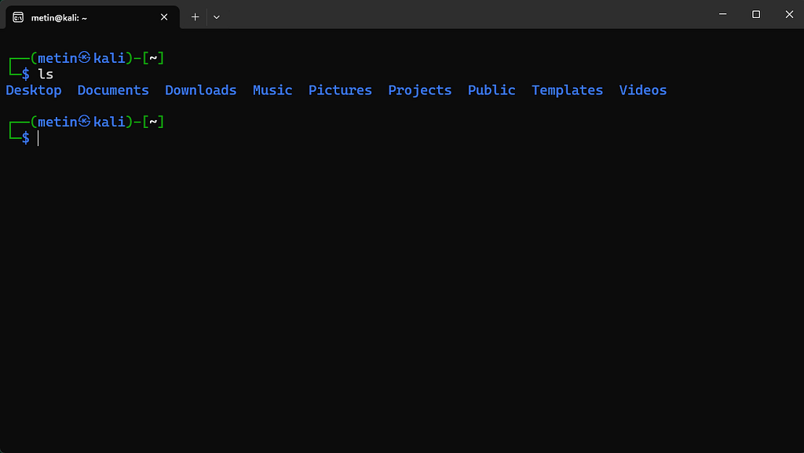
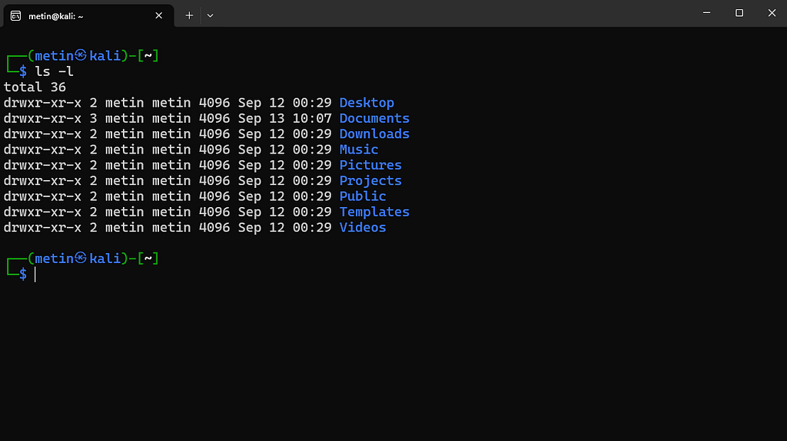
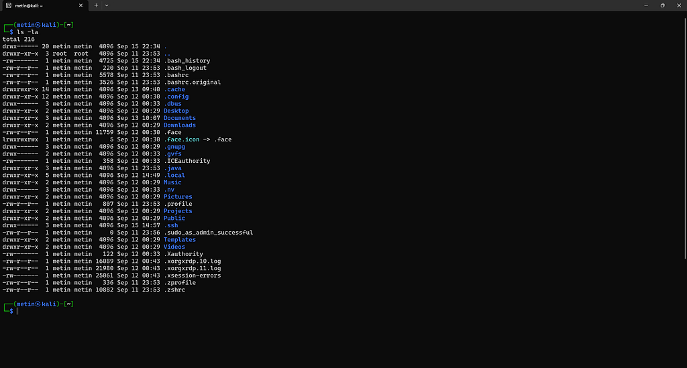

# 02 · Dosya sistemi ve gezinme

⬅ Medium'daki bölüm: **Dosya sistemi: nerede olduğumuzu bilmek** · [Part 0 içindekiler](README.md)

## Path: absolute ve relative

```
/home/metin/notes.txt
```

Bu ifade kök dizinden başlayan tam bir yolu gösterir. Buradaki ilk `/` kök dizindir; `home` onun altındaki dizin, `metin` onun altındaki başka bir dizin ve en sonunda `notes.txt` dosyasına ulaşırız. Kökten başladığı için nerede olduğumuzdan bağımsız olarak aynı konumu ifade eder: buna **absolute path** denir.

Buna karşılık `notes.txt` ya da `./notes.txt` gibi ifadeler bulunduğumuz konuma göre anlam kazanır: bunlara **relative path** denir. `/home/metin` içindeyken `notes.txt` ile `/home/metin/notes.txt` aynı dosyadır; `/tmp` içindeyken değildir.

## pwd: neredeyim?

`pwd`, *print working directory* anlamına gelir.



`/home/metin` çıktısını görüyorsak o anda `/home/metin` dizinindeyizdir.

## whoami: kimim?



Bu çıktı, mevcut shell oturumunda `metin` kullanıcısı olduğumuzu gösterir. Özellikle uzak sistemlerde çalışırken bu iki bilgiyi bilmek temel bir alışkanlıktır.

## Prompt'u okumak

Prompt'un görünümü sisteme göre değişir. Ubuntu'da tek satırdır:

```
metin@ubuntu:~$
```

Bu repodaki ekran görüntülerinin çekildiği Kali'de iki satırdır:

```
┌──(metin㉿kali)-[~]
└─$
```

İkisi de aynı bilgiyi taşır: kullanıcı (`metin`), makine (`ubuntu` / `kali`), bulunduğumuz dizin (`~`) ve kullanıcı türü. Satır sonundaki `$` normal kullanıcıyı gösterir; yönetici (root) olarak çalışırken yerinde `#` görünür. Dizin kısmı da yalnız ev dizinindeyken `~` yazar, başka bir yerdeyken tam yolu gösterir (ör. `/tmp`).

## cd: dizin değiştirmek

`cd`, *change directory* anlamına gelir. Argüman olarak verdiğimiz yol neresiyse, o dizine geçeriz.

**Bir üst dizine çıkmak:** `/home` içindeyken `cd ..` bizi köke (`/`) götürür.



**Bir alt dizine girmek:** aşağıdaki görüntüde önce kök dizindeyiz (`pwd` → `/`), `ls` ile içeriğe bakıyoruz ve `cd tmp/` ile `tmp` alt dizinine giriyoruz.



Burada `tmp/` bir **relative path**'tir: yalnız kök dizindeyken `/tmp`'ye götürür. Başka bir dizindeyken aynı komut `No such file or directory` hatası verir. Nerede olursak olalım `/tmp`'ye gitmek için absolute path kullanırız: `cd /tmp`.

Birkaç kullanışlı biçim daha:

```
cd        → ev dizinine dön
cd ~      → aynı şey
cd -      → bir önceki dizine geri dön
```

`cd -` önceki dizinin yolunu da ekrana yazar. Örneğin `/etc`'den `/var`'a geçtikten sonra `cd -` yazarsak çıktı `/etc` olur ve oraya döneriz.

## ls: dizinin içeriği



Daha ayrıntılı bir görünüm için `ls -l`:



Gizli dosyaları da görmek için `ls -la`:



Linux'ta `.` ile başlayan isimler normal listelemede gizli kabul edilir. `ls` bunları varsayılan olarak göstermez; `-a` seçeneği bu öğeleri de listeye dahil eder. `ls -la` örneğini şöyle okuyabiliriz:

```
ls      → listele
-l      → ayrıntılı göster
-a      → gizli öğeleri de dahil et
```

`-a`, listeye `.` (bulunduğumuz dizin) ve `..` (üst dizin) girdilerini de ekler. Bunları görmek istemezsek `ls -A` kullanırız: gizli dosyaları gösterir, `.` ve `..`'yu göstermez.

## ls -l çıktısını sütun sütun okumak

```
-rw-r--r-- 1 metin metin 6 Sep 16 12:55 test.txt
```

```
-rw-r--r--    → tür ve izinler (bkz. 07 · İzinler)
1             → bağlantı (link) sayısı
metin         → sahip (owner)
metin         → grup (group)
6             → boyut, bayt cinsinden
Sep 16 12:55  → son değiştirilme zamanı
test.txt      → ad
```

## Linux dizin ağacı: sık karşılaşacağımız yerler

```
/            → kök; her şey buradan dallanır
/home        → kullanıcıların ev dizinleri (/home/metin)
/root        → root kullanıcısının ev dizini
/etc         → sistem ve program ayar dosyaları
/tmp         → geçici dosyalar; herkes yazabilir
/var         → değişen veriler; ör. /var/log altında kayıtlar
/usr/bin     → programların çoğu (ls, cat, grep...)
```
