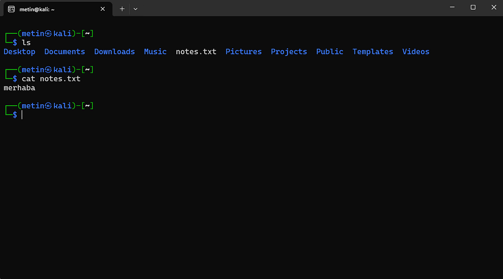

# 04 · Dosya içeriğini okumak

⬅ Medium'daki bölüm: **Dosya içeriğini okumak** · [Part 0 içindekiler](README.md)

## cat



Burada `cat`, dosyanın içeriğini okuyup standart çıktıya (stdout) gönderir. Yani dosyayı grafik arayüzdeki gibi özel bir editör penceresinde açmaz; içeriği okur ve terminalin çıktı akışına aktarır. Bu ayrım önemlidir, çünkü bir programın ürettiği çıktı başka bir programın girdisi hâline gelebilir (bkz. [05 · Akışlar, pipe ve yönlendirme](05-akislar-pipe-yonlendirme.md)).

Adı *concatenate* (art arda eklemek) sözcüğünden gelir: birden çok dosya verirsek hepsini sırayla basar.

```
cat /etc/hostname /etc/os-release
```

## less: uzun içeriği sayfa sayfa okumak

Dosya çok uzunsa bütün içeriği tek seferde terminale basmak pek kullanışlı olmaz. `less`, içeriği sayfalar hâlinde incelememizi sağlar:

```
less /etc/services
```

`less` içindeyken:

```
↑ / ↓       → satır satır gezin
Space       → bir sayfa ileri
b           → bir sayfa geri
g / G       → en başa / en sona git
/kelime     → ileriye doğru "kelime"yi ara
n           → sonraki eşleşme
q           → çık
```

Aynı tuşlar `man` sayfalarında da çalışır (bkz. [10 · Yardım ve hata mesajları](10-yardim-ve-hata-mesajlari.md)).

## head ve tail: başına ve sonuna bakmak

Bütün dosyayı açmadan yalnız başına ya da sonuna bakmak çoğu zaman yeterlidir:

```
head -n 3 /etc/services
```

```
# Network services, Internet style
#
# Updated from https://www.iana.org/assignments/service-names-port-numbers/service-names-port-numbers.xhtml .
```

```
tail -n 2 /etc/services
```

`-n` kaç satır istediğimizi belirtir; yazmazsak ikisi de 10 satır gösterir.

## du: bir dosya ya da dizin ne kadar yer kaplıyor?

```
du -h /etc/services
```

`du` diskte kaplanan alanı gösterir; `-h` bunu `K`, `M` gibi okunur birimlerle yazar. Bir dizine uygulandığında alt dizinleri de tek tek listeler.
