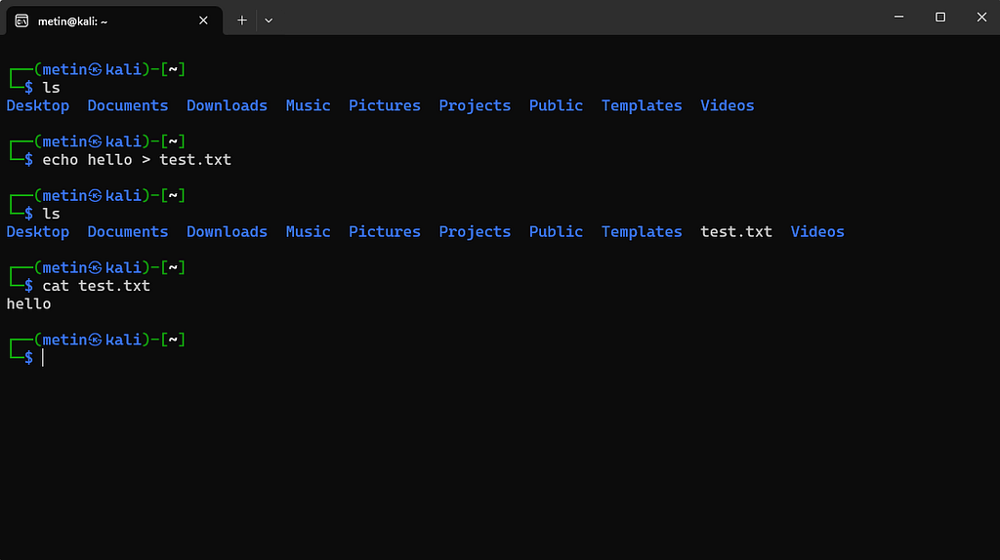
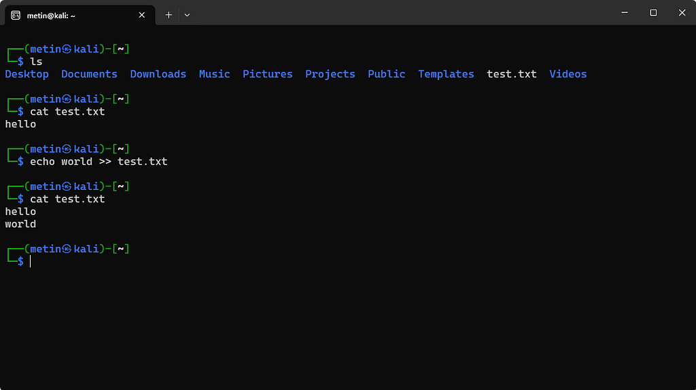

# 05 · Akışlar, pipe ve yönlendirme

⬅ Medium'daki bölüm: **Girdi, çıktı ve hata akışları** · [Part 0 içindekiler](README.md)

## Üç akış

```
stdin   (0) → programın girdisi (varsayılan: klavye)
stdout  (1) → normal çıktısı (varsayılan: ekran)
stderr  (2) → hata ve tanı mesajları (varsayılan: ekran)
```

Bir program veri okuyabilir, normal bir çıktı üretebilir ve hata mesajlarını ayrı bir akış üzerinden gönderebilir. stdout ile stderr aynı ekrana düştüğü için ilk bakışta ayırt edilemez; aşağıdaki deney farkı gösterir.

## Deney: stdout ile stderr gerçekten ayrı mı?

```
cat yok.txt > out.txt
```

```
cat: yok.txt: No such file or directory
```

`>` yalnız stdout'u dosyaya yönlendirdi. Hata mesajı stderr'den geldiği için yine ekrana düştü, `out.txt` ise boş kaldı (`wc -c out.txt` → `0 out.txt`).

## Redirection: çıktıyı dosyaya yönlendirmek

`echo hello > test.txt` komutu, `echo` tarafından üretilen çıktıyı `test.txt` dosyasına yönlendirir. Dosya yoksa oluşturulur; dosya zaten varsa mevcut içeriğin üzerine yazılır.



Dosyanın sonuna eklemek için ise `>>` kullanılır:



```
>   → üzerine yaz
>>  → sona ekle
```

Yanlışlıkla `>` kullanmak mevcut dosya içeriğinin silinmesine neden olabilir. Bu yüzden redirection operatörlerini yalnızca sözdizimi olarak değil, dosya üzerindeki etkileriyle birlikte düşünmek gerekir.

## stderr'i yönlendirmek: 2>, 2>/dev/null, 2>&1

```
cat yok.txt 2> hata.txt          → hata ekrana değil dosyaya gider
find /etc -name "passwd" 2>/dev/null  → hata mesajları yok edilir
```

`2>` bitişik yazılır; `2 >` yazarsak shell `2`'yi ayrı bir argüman sanar. `/dev/null`, içine yazılan her şeyi yok eden özel bir dosyadır.

İki akışı **aynı** dosyada toplamak için `2>&1` ("2'yi, 1'in gittiği yere gönder") kullanılır:

```
cat /etc/hostname yok.txt > hepsi.txt 2>&1
cat hepsi.txt
```

```
DESKTOP-LMNKVGJ
cat: yok.txt: No such file or directory
```

İlk satır stdout'tan (dosyanın içeriği), ikincisi stderr'den geldi; ikisi de dosyaya yazıldı. Sıra önemlidir: `2>&1` yönlendirmeden **sonra** yazılır.

## stdin'i yönlendirmek: <

Klavye yerine bir dosyayı programın girdisi yapabiliriz:

```
wc -l < /etc/services
```

`wc -l` satır sayar; burada girdisini `/etc/services` dosyasından okudu (Kali'de `365`; sayı sisteme göre değişir).

## Pipe: bir komutun çıktısını diğerine bağlamak

```
command1 | command2
```

`|`, birinci komutun stdout'unu ikinci komutun stdin'ine bağlar. Pipe'lar zincirlenebilir:

```
cat /etc/passwd | grep "bash" | wc -l
```

```
cat /etc/passwd   → kullanıcı listesini bas
grep "bash"       → yalnız bash geçen satırları bırak
wc -l             → kalan satırları say
```

Pipe yalnız stdout'u taşır; stderr bir sonraki komuta gitmez, ekrana düşer.

## Küçük komutlarla büyük işler

Linux araçlarının önemli özelliklerinden biri, çoğunun tek bir görevi nispeten sade biçimde yapmasıdır: `ls` listelemede, `grep` metin aramada, `find` dosya bulmada iyidir; `less` çıktıyı incelemeyi kolaylaştırır. Bunları pipe ile birleştirdiğimizde çok daha güçlü işlemler ortaya çıkar. Yani terminalde güçlü olmanın önemli bir kısmı tek tek "güçlü komutlar" bulmak değil, küçük araçları anlamlı biçimde bir araya getirmektir.
