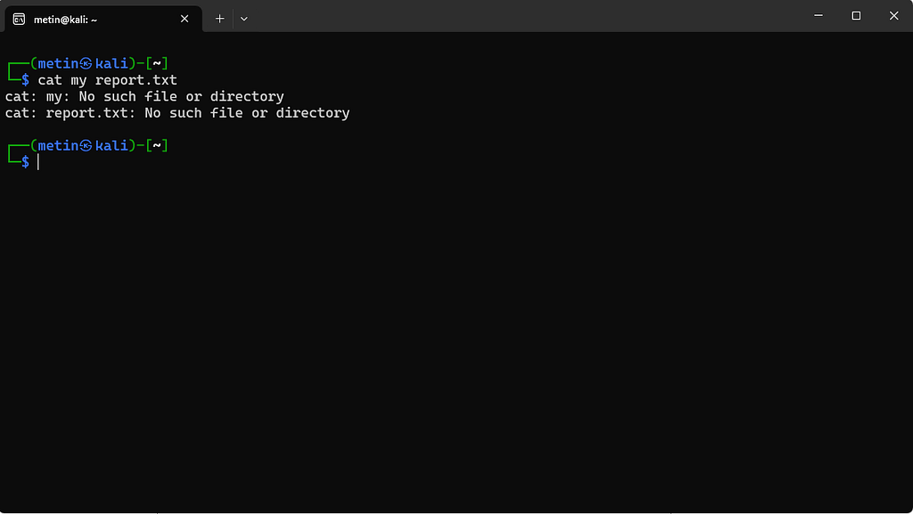
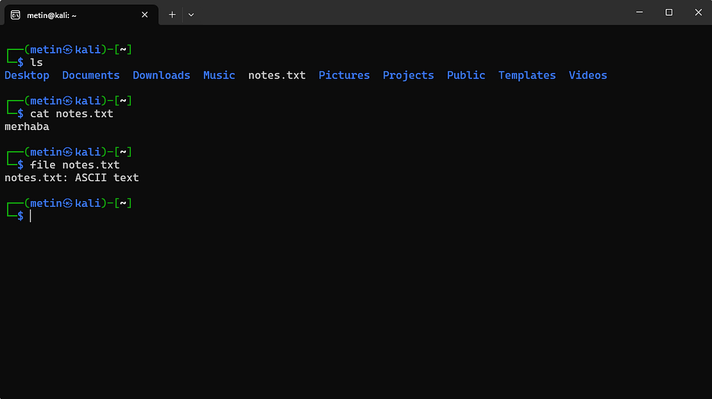

# 06 · Dosya adları ve türleri

⬅ Medium'daki bölüm: **Dosya adları ve türleri** · [Part 0 içindekiler](README.md)

## Boşluk içeren adlar

Dosya henüz yokken `cat my report.txt` yazdığımızda shell satırı boşluktan böler ve `cat` iki ayrı dosya arar:



İki hata mesajı bunun kanıtı: biri `my`, biri `report.txt` için. Dosyayı oluşturup doğru yazımları deneyelim:

```
echo "merhaba" > "my report.txt"
cat "my report.txt"
cat my\ report.txt
```

```
merhaba
merhaba
```

İki yöntem de aynı temel problemi çözer: shell'e bu ifadenin tek bir argüman olduğunu söylüyoruz. Bu konu ilk bakışta küçük bir ayrıntı gibi görünebilir ama komut satırının temel mantıklarından biridir: shell, yazdığımız metni olduğu gibi programa göndermeden önce belirli kurallara göre yorumlar. Bu nedenle alışılmadık bir dosya adıyla karşılaştığımızda hemen dosyanın bozuk olduğunu düşünmeyeceğiz; önce shell'in o ismi nasıl yorumladığına bakacağız.

**Tab tamamlaması:** `cat my` yazıp Tab'a basarsak shell adı `cat my\ report.txt` olarak kendisi tamamlar.

## Tek tırnak ve çift tırnak

İkisi de boşluğu korur, ama içlerindeki `$` farklı yorumlanır:

```
echo "$HOME"   → /home/metin   (çift tırnak: değişken açılır)
echo '$HOME'   → $HOME         (tek tırnak: her şey olduğu gibi kalır)
```

Dosya adı için ikisi de çalışır; içinde `$` gibi özel karakter olan bir metni aynen korumak istediğimizde tek tırnak daha güvenlidir.

## Tire (-) ile başlayan adlar

Seçenekler `-` ile başladığı için, adı `-` ile başlayan bir dosyayı komut seçenek sanabilir:

```
cat -file
```

```
cat: invalid option -- 'f'
```

Tırnak bu sorunu çözmez: `cat "-file"` aynı hatayı verir, çünkü shell tırnakları programa göndermeden önce kaldırır ve `cat` yine `-file` görür. Boşluk sorunu shell'in, tire sorunu komutun yorumundan doğar.

Tek başına `-` ise birçok komut için "stdin'den oku" anlamına gelir: `cat -` yazarsak komut klavyeden girdi bekler (çıkmak için Ctrl+C).

> Bu tür adları açmanın yolları Part 1'de, Bandit seviyelerinin içinde uygulamalı olarak ele alınıyor.

⚠ Hata mesajının metni dağıtıma göre değişebilir. Aynı komut Kali'de `cat: invalid option -- 'f'`, yeni coreutils kullanan Ubuntu 26.04'te `error: unexpected argument '-f' found` yazar; anlamı aynıdır.

## Uzantı, türü belirlemez

Grafik arayüzlerde bir dosyanın uzantısına bakarak türü hakkında fikir sahibi olmaya alışıyoruz (`photo.jpg`, `archive.zip`, `notes.txt`). Terminalde ise yalnızca dosya adına güvenmek doğru değildir. `file` komutu, dosyanın içeriğini inceleyerek ne tür bir dosya olduğunu belirlemeye yardımcı olur:



Uzantısız, anlamsız görünen bir adla da aynı sonuç alınır:

```
echo "merhaba" > backup
file backup
```

```
backup: ASCII text
```

Sıkıştırılmış bir dosyada ise `file` başka bir tür söyler:

```
gzip -k backup
file backup.gz
```

```
backup.gz: gzip compressed data, was "backup", last modified: Wed Sep 16 09:53:31 2026, from Unix, original size modulo 2^32 8
```

Bu yüzden terminalde dosya adını, dosyanın kendisiyle karıştırmamak iyi bir alışkanlıktır. (Uzantı yine de bir ad geleneği olarak işe yarar; örneğin `gunzip` açacağı dosyanın adının `.gz` ile bitmesini bekler.)

## Terminal bozulursa: reset

Türünü bilmediğimiz, metin olmayan bir dosyayı `cat` ile basarsak ekran anlamsız karakterlerle dolabilir, hatta yazdıklarımız düzgün görünmeyebilir. Böyle olursa:

```
reset
```

terminali toparlar. Önce `file` ile bakmak bu durumu baştan önler.
