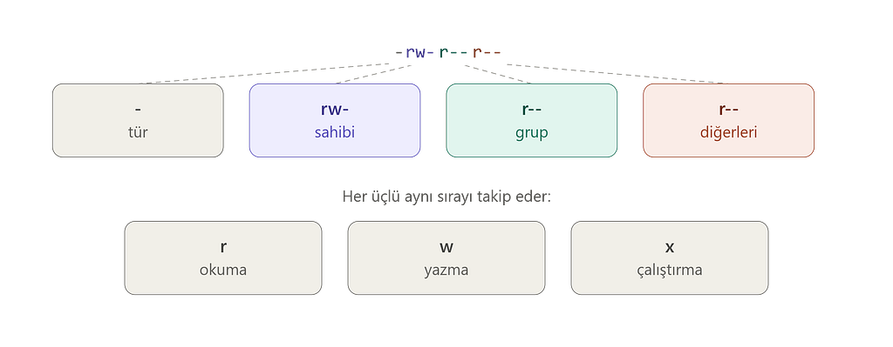

# 07 · İzinler

[Başlangıç](../README.md) · [Part 0 içindekiler](README.md)

Linux'ta dosyaların yalnızca isimleri ve içerikleri yoktur. Kimlerin o dosyayı okuyabileceği, değiştirebileceği veya çalıştırabileceği de önemlidir. Bir dosyanın sahibi olabilir, bir gruba ait olabilir ve farklı kullanıcı kategorileri için farklı izinlere sahip olabilir.

## İzin dizesini okumak



```
-rw-r--r--
```

```
-      → tür: - normal dosya, d dizin, l sembolik bağlantı
rw-    → sahip (owner): okuyabilir, yazabilir, çalıştıramaz
r--    → grup (group): yalnız okuyabilir
r--    → diğerleri (others): yalnız okuyabilir
```

Üçlünün içindeki `-`, o iznin **olmadığı** anlamına gelir.

## Sahip ve grup: ls -l'de nerede?

```
-rw-r--r-- 1 metin metin 6 Sep 16 12:55 test.txt
```

Üçüncü sütun sahip (`metin`), dördüncü sütun grup (`metin`). Çoğu sistemde her kullanıcının kendi adında bir grubu da vardır; bu yüzden ikisi aynı görünebilir.

## Ben kimim, hangi gruplardayım: id

```
id
```

```
uid=1000(metin) gid=1000(metin) groups=1000(metin),4(adm),24(cdrom),27(sudo),30(dip),46(plugdev),100(users),111(wireshark)
```

Bir dosyaya erişmeye çalıştığımızda sistem sırayla bakar: dosyanın sahibi miyiz → sahip izinleri; değilsek dosyanın grubunda mıyız → grup izinleri; ikisi de değilse → diğerleri.

## İznimiz yoksa

```
cat /etc/shadow
```

```
cat: /etc/shadow: Permission denied
```

## Dizinlerde r, w, x ne demek?

Dosyada anlamları açıktır; dizinde biraz farklıdır:

```
r  → dizinin içeriğini listeleyebilir (ls)
w  → dizinde dosya oluşturabilir, silebilir, yeniden adlandırabilir
x  → dizine girebilir (cd) ve içindeki dosyalara erişebilir
```

```
ls -ld /tmp
```

```
drwxrwxrwt 10 root root 4096 Sep 16 12:55 /tmp
```

`d` bunun bir dizin olduğunu, `rwxrwxrwx` herkesin yazabildiğini gösterir. Sondaki `t` (sticky bit) ise herkesin yazabildiği bu dizinde kullanıcıların yalnız **kendi** dosyalarını silebilmesini sağlar. (`-d` seçeneği, dizinin içini değil kendisini listeler.)

## İzinleri değiştirmeye giriş: chmod

```
echo "#!/bin/bash" > betik.sh
ls -l betik.sh
chmod u+x betik.sh
ls -l betik.sh
```

```
-rw-r--r-- 1 metin metin 12 Sep 16 12:56 betik.sh
-rwxr--r-- 1 metin metin 12 Sep 16 12:56 betik.sh
```

`u+x`: sahibe (**u**ser) çalıştırma (**x**) iznini ekle. Aynı kalıpla `g` (grup), `o` (diğerleri), `a` (hepsi); `+` ekler, `-` kaldırır: `chmod o-r dosya` diğerlerinin okuma iznini kaldırır.

⚠ WSL'de Windows diski (`/mnt/c/...`) üzerindeki dosyalarda izinler Linux'taki gibi davranmayabilir; denemeleri ev dizininde ya da `/tmp`'de yapalım.

<!-- part0-altnav -->

---

← [06 · Dosya adları ve türleri](06-dosya-adlari-ve-turleri.md) · [Part 0 içindekiler](README.md) · [08 · grep ve find](08-grep-ve-find.md) →
