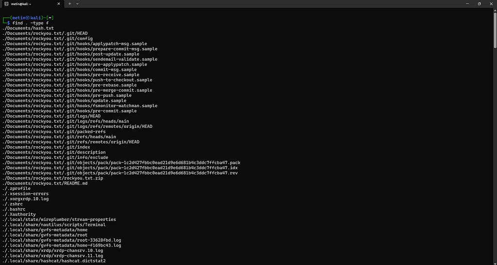

# 08 · grep ve find

[Başlangıç](../README.md) · [Part 0 içindekiler](README.md)

## grep: metin içinde aramak

`grep`'i, büyük bir metni tek tek okuyup aramak yerine aramayı doğrudan programa yaptırmak gibi düşünebiliriz. Yalnızca sabit bir kelime aramak için kullanılmaz; düzenli ifadeler (regular expressions) ve çeşitli seçeneklerle daha karmaşık desenleri de arayabilir.

Seçenekleri denemek için küçük bir dosya hazırlayalım:

```
printf "Error: a\nerror: b\ninfo: c\n" > log.txt
```

```
grep "error" log.txt      → error: b
```

`grep` büyük/küçük harfe duyarlıdır; `Error` satırı eşleşmedi.

```
grep -i "error" log.txt   → Error: a
                            error: b
```

`-i`: büyük/küçük harf farkını yok say.

```
grep -v "error" log.txt   → Error: a
                            info: c
```

`-v`: eşleş**meyen** satırları göster.

```
grep -n "info" log.txt    → 3:info: c
```

`-n`: satır numarasını da yaz.

`-r`: bir dizinin altındaki bütün dosyalarda ara:

```
grep -r "Port" /etc/ssh 2>/dev/null
```

```
/etc/ssh/ssh_config:#   Port 22
/etc/ssh/sshd_config:#Port 22
```

Birden çok dosyada aradığında `grep` eşleşmenin hangi dosyada olduğunu satırın başına yazar.

## find: dosya aramak

`ls` bize bir dizinin içeriğini gösterir. Peki çok daha büyük bir dizin ağacında belirli bir dosyayı aramamız gerektiğinde? Burada `find` devreye girer. `find` ile sadece isim değil; dosyanın türü, boyutu, sahibi, izinleri ve değişiklik zamanı gibi farklı özelliklere göre de arama yapılabilir.

`find . -type f`, bulunduğumuz dizinden başlayarak **bütün alt dizinlere inip** normal dosyaları listeler. Ev dizininde çalıştırınca çıktının ne kadar uzun olabileceği görülüyor:



Sık kullanılan koşullar:

```
-name "notes.txt"   → adı tam olarak bu olanlar
-name "*.txt"       → adı .txt ile bitenler (tırnak şart)
-type f / -type d   → normal dosya / dizin
-size +20M          → 20 MB'tan büyük olanlar
-user metin         → sahibi metin olanlar
-group metin        → grubu metin olanlar
-maxdepth 1         → alt dizinlere inme
```

Koşullar art arda yazılınca **hepsi birden** sağlanmalıdır:

```
find /etc -maxdepth 1 -type d -name "ssh*"
```

```
/etc/ssh
```

`-name "*.txt"` deseninde tırnak şarttır; tırnaksız yazarsak shell `*`'ı `find` çalışmadan önce bulunduğumuz dizindeki dosya adlarıyla genişletebilir.

## Hatalardan arınmış arama

Normal kullanıcıyla geniş bir alanda arama yaparken okuma iznimiz olmayan dizinler için `Permission denied` satırları çıkar:

```
find /etc -name "passwd"
```

```
/etc/pam.d/passwd
/etc/passwd
find: ‘/etc/ssl/private’: Permission denied
...
```

Bunlar stderr'e gittiği için `2>/dev/null` ile ayıklanır (bkz. [05](05-akislar-pipe-yonlendirme.md)):

```
find /etc -name "passwd" 2>/dev/null
```

## find ve grep birlikte

```
find /etc -type f 2>/dev/null | grep "ssh"
```

```
/etc/ssh/ssh_config
/etc/ssh/ssh_host_ecdsa_key
/etc/ssh/ssh_host_rsa_key.pub
```

Burada tek bir program her şeyi yapmıyor: ilk araç dosyaları buluyor, ikinci araç gelen çıktının içinde `ssh` ifadesini arıyor. Dikkat: `grep` burada dosyaların **içinde** değil, `find`'ın ürettiği **dosya adı listesinde** arıyor.

<!-- part0-altnav -->

---

← [07 · İzinler](07-izinler.md) · [Part 0 içindekiler](README.md) · [09 · SSH](09-ssh.md) →
