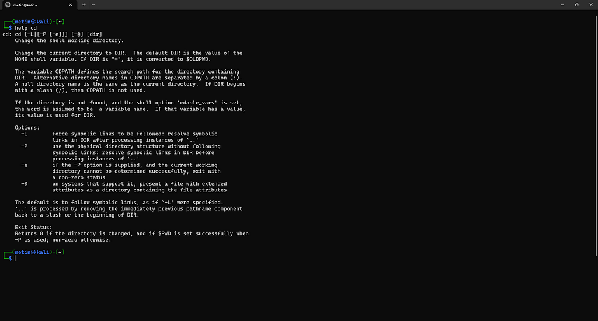
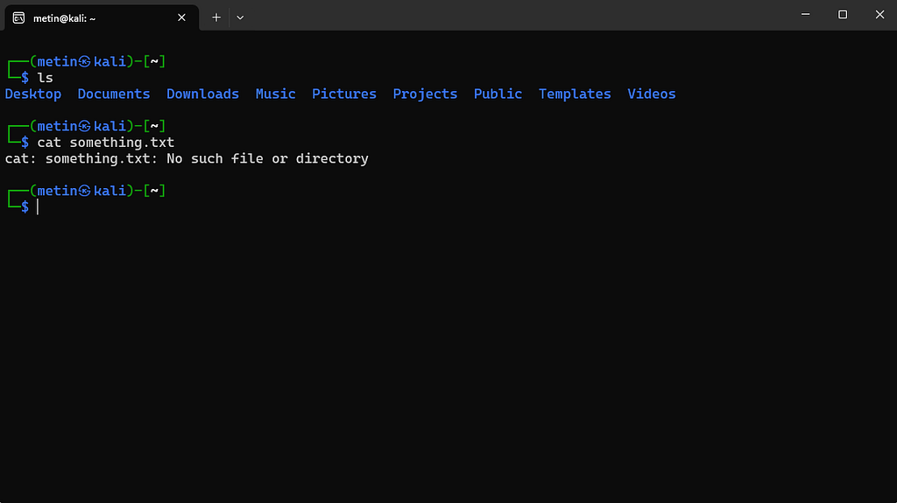

# 10 · Yardım ve hata mesajları

⬅ Medium'daki bölüm: **Takıldığımızda: yardım almak ve hata mesajlarını okumak** · [Part 0 içindekiler](README.md)

## Üç yardım kaynağı

```
man ls      → ls'in manual sayfası
help cd     → Bash built-in komutları için yardım
ls --help   → programın kendi kısa yardım çıktısı
```

Üçünün amacı benzer olsa da aynı şey değildir. `man` bir komutun manual sayfasını açarken, `help` Bash'in built-in komutları hakkında bilgi verir. `--help` ise ilgili programın kendi yardım çıktısını gösterir.

`help cd` çıktısı:



## Hangisine bakacağımızı type söyler

```
type cd
type ls
type echo pwd help
```

```
cd is a shell builtin
ls is hashed (/usr/bin/ls)
echo is a shell builtin
pwd is a shell builtin
help is a shell builtin
```

`shell builtin` yazıyorsa `help`, bir dosya yolu (`/usr/bin/ls`) yazıyorsa `man` ve `--help`. (`hashed`, shell'in programın yerini hatırladığı anlamına gelir.) `echo` ve `pwd` hem built-in hem ayrı program olarak bulunur; Bash'te built-in olanı çalışır.

## Bir man sayfasını okumak

man sayfaları hep aynı iskeleti izler:

```
NAME          → komutun adı ve tek satırlık tanımı
SYNOPSIS      → kullanım kalıbı; [köşeli parantez] isteğe bağlı demek
DESCRIPTION   → ne yaptığı
OPTIONS       → seçenekler tek tek
```

man, `less` ile açılır; aynı tuşlar geçerlidir (bkz. [04](04-dosya-icerigini-okumak.md)). En işe yarayanı arama: `/-a` yazıp Enter'a basınca `-a` seçeneğinin geçtiği ilk yere gideriz, `n` ile sonrakine, `q` ile çıkarız.

Burada geliştirmemiz gereken alışkanlık çok basit: **bir komutun ne yaptığını bilmiyorsak, önce dokümantasyonuna bakarız.**

## Hata mesajlarını okumak

Terminalde hata görmek olağandır. Hatta çoğu zaman hata mesajı, sorunun nerede olduğunu anlamamız için elimizdeki en iyi ipucudur.



Bu hatayı görüyorsak hemen başka bir komut denemek yerine mevcut durumu kontrol etmek daha mantıklıdır: önce `pwd` ile nerede olduğumuza, ardından `ls -la` ile dosyanın gerçekten o dizinde olup olmadığına bakarız. Belki dosya başka bir dizindedir. Belki dosyanın adı farklıdır. Belki de bulunduğumuz yer düşündüğümüz yer değildir.

Hata mesajları çoğunlukla aynı kalıptadır: **`program: neyle ilgili: ne oldu`**.

## Sık görülen hata mesajları

```
No such file or directory   → bu adda dosya/dizin yok (yer mi yanlış, ad mı?)
Permission denied           → var ama iznimiz yok (bkz. 07 · İzinler)
Is a directory              → dosya beklenirken dizin verildi (ör. cat /etc)
Not a directory             → dizin beklenirken dosya verildi (ör. cd /etc/passwd)
command not found           → böyle bir komut yok ya da yanlış yazıldı
invalid option              → komut bu seçeneği tanımıyor (bkz. 06, tire ile başlayan adlar)
```

Gerçek çıktılar (Kali):

```
cat: /etc/shadow: Permission denied
cat: /etc: Is a directory
bash: cd: /etc/passwd: Not a directory
foo123: command not found
```

(Kali'deki "komut bulunamadı" yardımcısı yüzünden son satırın başında `bash:` yok; başka sistemlerde `bash: foo123: command not found` biçiminde görünebilir.)

⚠ Aynı hata farklı dağıtımlarda farklı yazılabilir. Örneğin yeni coreutils kullanan Ubuntu 26.04'te geçersiz seçenek hatası `error: unexpected argument '-f' found` biçiminde çıkar. Kalıbı değil, anlamı okuruz.
