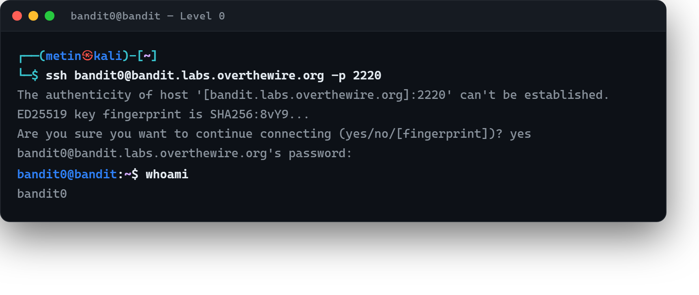

# 00 · Sunucuya SSH ile bağlanmak

[Başlangıç](../README.md) · [Part 1 içindekiler](README.md)

Level 0'ın tek amacı var: oyuna **SSH ile giriş yapmak.** Henüz çözülecek bir bulmaca yok; yalnızca uzak sunucudaki `bandit0` kullanıcısına bağlanacağız.

## Bağlantı

Part 0'da [SSH'ı tanımıştık](../part-0/09-ssh.md); komutun yapısı `ssh kullanıcı@sunucu` biçimindeydi. Bandit varsayılan olmayan bir port (2220) kullandığı için `-p` ekleriz:

```
$ ssh bandit0@bandit.labs.overthewire.org -p 2220
```

`bandit0` kullanıcısının parolası, OverTheWire'ın kendi [Level 0 sayfasında](https://overthewire.org/wargames/bandit/bandit0.html) açıkça verilir; oradan alıp gireriz. (Bundan sonraki seviyelerin parolalarını ise kendimiz bulacağız.)

İlk bağlantıda sunucunun kimliğini onaylamamız istenir:

```
The authenticity of host '...' can't be established.
ED25519 key fingerprint is SHA256:...
Are you sure you want to continue connecting (yes/no/[fingerprint])?
```

Part 0'da gördüğümüz gibi `yes` yazıp Enter'a basarız. Ardından parola sorulur; **yazarken ekranda hiçbir karakter görünmez** — yıldız bile çıkmaz, bu normaldir. Doğru parolayı girince prompt değişir:

```
bandit0@bandit:~$
```

Artık uzak sunucudayız. Emin olmak istersek `whoami` bize `bandit0`, `pwd` ise ev dizinimizi gösterir. Oturumu kapatıp kendi makinemize dönmek için `exit` yazarız.



## Sırada

Bağlandık; şimdi bir sonraki seviyenin parolasını bulmamız gerekiyor. O da ev dizinimizdeki bir dosyada duruyor.

> **Faydalı olabilir:** [Bandit Level 0](https://overthewire.org/wargames/bandit/bandit0.html) — bağlantı bilgileri ve SSH okuma kaynakları.

<!-- part1-altnav -->

---

[Part 1 içindekiler](README.md) · [01 · readme: ilk parolayı okumak](01-readme-dosyasi.md) →
