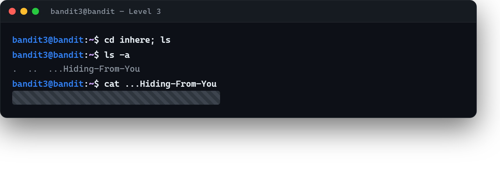

# 04 · Gizli dosya

[Başlangıç](../README.md) · [Part 1 içindekiler](README.md)

**Hedef:** `bandit4`'ün parolası, `inhere` adlı dizinin içindeki **gizli** bir dosyada.

## inhere'e girip bakalım

```
$ ls
inhere
```

`inhere` bir dizin. İçine girip listeleriz:

```
$ cd inhere
$ ls
```

`ls` hiçbir şey göstermedi — dizin boş mu? Hayır. Adı `.` ile başlayan dosyalar Linux'ta "gizli" sayılır ve düz `ls` çıktısında görünmez. Part 0'da gördüğümüz `-a` seçeneği hepsini gösterir ([02 · Dosya sistemi ve gezinme](../part-0/02-dosya-sistemi-ve-gezinme.md)):

```
$ ls -a
.
..
.hidden
```

`.` (bulunduğumuz dizin) ve `..` (üst dizin) dışında `.hidden` adlı bir dosya var. Okuruz:

```
$ cat .hidden
PAROLA_BURADA
```



## Perde arkası

`.` ile başlayan adların gizli sayılması bir dosya sistemi kuralı değil, `ls` gibi araçların bir davranışıdır: baştaki noktayı görünce dosyayı varsayılan listede atlarlar. `-a` (`--all`) bu filtreyi kapatır. Grafik arayüzlerdeki "gizli dosyaları göster" seçeneği de tam olarak bunu yapar.

> **Faydalı olabilir:** [Bandit Level 4](https://overthewire.org/wargames/bandit/bandit4.html).

## Part 1'in sonunda

Beş adımda Bandit'e bağlandık ve Part 0'daki dört ayrı kavramı — dosya okuma, tire ile başlayan ad, boşluklu ad, gizli dosya — ilk kez gerçek bir hedefte kullandık. Önemli olan parolaları bulmak değil, "elimde ne var, bunu nasıl açarım?" diye düşünebilmekti. Seri, Level 5–9 ile Part 2'de devam edecek.

<!-- part1-altnav -->

---

← [03 · Adında boşluk olan dosya](03-bosluklu-dosya-adi.md) · [Part 1 içindekiler](README.md)
