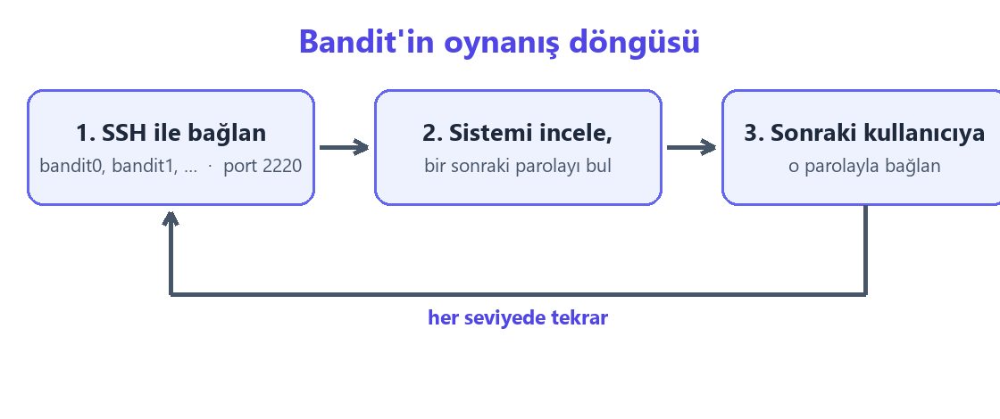

# Part 1 — Bandit Level 0–4

[Başlangıç](../README.md)

Part 0'da öğrendiğimiz komutları ilk kez gerçek bir hedefte kullanıyoruz: [OverTheWire Bandit](https://overthewire.org/wargames/bandit/). Bandit, komut satırı temellerini uygulamalı öğreten, yeni başlayanlar için tasarlanmış bir "savaş oyunu" (wargame). Bu part, Level 0'dan Level 4'e kadarki ilk beş adımı kapsar.

## Bandit nasıl oynanır?

Oyun seviyelerden oluşur. Her seviyede bir sonraki seviyenin **parolasını** bulmamız gerekir; işleyiş şöyle:

1. O seviyenin kullanıcısıyla sunucuya **SSH ile bağlanırız** (`bandit0`, sonra `bandit1`, …).
2. Bağlandıktan sonra sistemi inceleyerek **bir sonraki parolayı buluruz** — bir dosyanın içinde, gizli bir yerde ya da bir komutun çıktısında.
3. Bulduğumuz parolayla **bir sonraki kullanıcıya** yine SSH ile bağlanırız.



Sunucu bilgileri her seviyede aynıdır:

```
Sunucu : bandit.labs.overthewire.org
Port   : 2220
```

> **Parolalar hakkında.** Bu repoda hiçbir seviyenin parolası yazmaz — hem OverTheWire'ın kuralları gereği, hem de parolalar zaman zaman değiştiği için. Her sayfa parolanın *nasıl* bulunacağını gösterir; bulduğun parolayı kendine bir yere not al (Bandit de bunu önerir), çünkü seviye parolaları otomatik saklanmaz.

## Bu part'ta ne yapıyoruz?

| Sayfa | Görev | Part 0 dayanağı |
|---|---|---|
| [00 · SSH ile bağlanmak](00-ssh-ile-baglanma.md) | Sunucuya ilk bağlantı | [09 · SSH](../part-0/09-ssh.md) |
| [01 · readme](01-readme-dosyasi.md) | Ev dizinindeki dosyayı okumak | `ls`, `cat` |
| [02 · Adı `-` olan dosya](02-tire-ile-baslayan-dosya.md) | Tire ile başlayan adı açmak | [06 · Dosya adları ve türleri](../part-0/06-dosya-adlari-ve-turleri.md) |
| [03 · Boşluklu ad](03-bosluklu-dosya-adi.md) | Boşluk içeren adı açmak | tırnak / `\` ile escape |
| [04 · Gizli dosya](04-gizli-dosya.md) | `.` ile başlayan dosyayı bulmak | `ls -a` |

## Örnekler hakkında

- Buradaki komut çıktıları, Bandit'in aynı mekaniğini **kendi makinemde yerel olarak** taklit ederek üretildi; gerçek sunucudaki dosya adları ve davranış aynıdır. Çıktılarda parola yerine görünen `PAROLA_BURADA`, gerçek oturumda 32 karakterlik rastgele bir dizidir.
- Kod bloklarında `$` ile başlayan satır bizim yazdığımız komuttur; altındaki satır(lar) çıktıdır.

---

[Başlangıç](../README.md) · [00 · SSH ile bağlanmak](00-ssh-ile-baglanma.md) →
