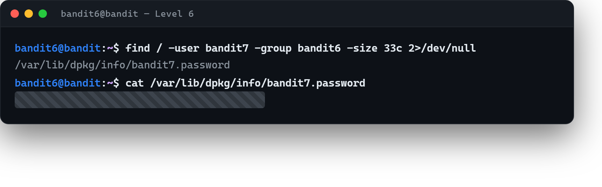

# 02 · Sahibine göre dosya bulmak

[Başlangıç](../README.md) · [Part 2 içindekiler](README.md)

**Hedef:** `bandit7`'nin parolası artık ev dizinimizde değil — **sunucunun herhangi bir yerinde** olabilir. Verilen ipuçları: dosya **`bandit7` kullanıcısına** ait, **`bandit6` grubuna** ait ve **33 bayt** boyutunda. Aramayı tüm dosya sisteminde yapacağız.

## Bütün diski taramak

Bu kez `.` (bulunduğumuz dizin) yerine `/` (kök) yani sistemin en tepesinden başlarız. `find`'a üç özelliği veririz:

```
$ find / -user bandit7 -group bandit6 -size 33c
```

- `-user bandit7` → sahibi bu kullanıcı olan,
- `-group bandit6` → grubu bu olan,
- `-size 33c` → 33 baytlık.

Kök dizinden tararken bir sorun çıkar: erişemediğimiz klasörlere girmeye çalışınca `find` her biri için hata basar ve gerçek sonuç bu gürültüde kaybolur:

```
find: '/root': Permission denied
find: '/etc/ssl/private': Permission denied
...
```

## Gürültüyü ayıklamak

Hata mesajları normal çıktıdan farklı bir akıştan (standart hata, *stderr*) gelir. Part 0'da gördüğümüz gibi (`[05 · Akışlar, pipe ve yönlendirme](../part-0/05-akislar-pipe-yonlendirme.md)`), bu akışı `2>/dev/null` ile çöpe yönlendirip yalnız gerçek sonucu bırakırız:

```
$ find / -user bandit7 -group bandit6 -size 33c 2>/dev/null
/var/lib/dpkg/info/bandit7.password
```

Geriye tek bir yol kaldı. Okuruz:

```
$ cat /var/lib/dpkg/info/bandit7.password
‹bandit7 parolası›
```



## Perde arkası

Buradaki iki ders güvenlikte sürekli işe yarar: (1) bir dosyayı **kim'e ait olduğuyla** aramak, sistemde "bu kullanıcının bıraktığı izler nerede?" sorusunun tam karşılığıdır; (2) `2>/dev/null` ile *stdout* ve *stderr*'i ayırmak, uzun taramalarda sinyali gürültüden ayırmanın standart yoludur. "İzin reddedildi" satırları başarısızlık değil — sadece bakamadığımız kapılar.

> **Faydalı olabilir:** [Bandit Level 7](https://overthewire.org/wargames/bandit/bandit7.html).

<!-- part2-altnav -->

---

← [01 · Boyut ve türe göre aramak](01-boyut-ve-ture-gore-aramak.md) · [Part 2 içindekiler](README.md) · [03 · Kalabalıkta bir kelime](03-kalabalikta-bir-kelime.md) →
