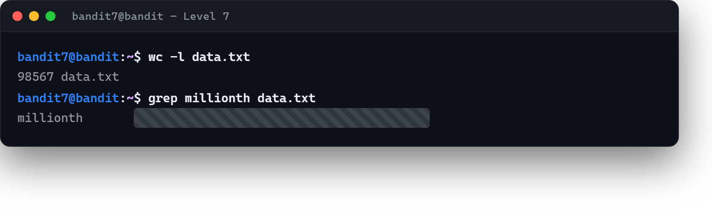

# 03 · Kalabalıkta bir kelime

[Başlangıç](../README.md) · [Part 2 içindekiler](README.md)

**Hedef:** `bandit8`'in parolası `data.txt` dosyasında, **`millionth` kelimesinin yanında** duruyor. Dosyayı açıp gözle aramak yerine, aradığımız satırı komuta buldururuz.

## Dosya ne kadar büyük?

```
$ wc -l data.txt
98567 data.txt
```

Doksan sekiz binden fazla satır — ekranda kaydırarak `millionth`'ı aramak akıl kârı değil. İşte `grep` tam bu iş için: bir metinde **belirli bir örüntüyü içeren satırları** süzer (Part 0 · [08 · grep ve find](../part-0/08-grep-ve-find.md)).

## grep ile süzmek

```
$ grep millionth data.txt
millionth	‹bandit8 parolası›
```

Tek satır. `grep`, `data.txt` içindeki on binlerce satırdan yalnızca `millionth` geçenini getirdi; parola hemen yanında, bir sekme (Tab) ile ayrılmış. Doğrudan `bandit8`'e geçmek için parolayı buradan alırız.



## Perde arkası

`grep`, büyük veriyle çalışmanın en temel refleksidir: "hepsine bakma, aradığını süz." Aynı komut bir günlük (log) dosyasında bir hata mesajını, bir yapılandırma dosyasında bir ayarı ya da bir kod tabanında bir fonksiyonu bulmak için birebir aynı şekilde kullanılır. Dosya büyüdükçe `grep`'in değeri artar — gözle tarama ölçeklenmez, süzme ölçeklenir.

> **Faydalı olabilir:** [Bandit Level 8](https://overthewire.org/wargames/bandit/bandit8.html).

<!-- part2-altnav -->

---

← [02 · Sahibine göre dosya bulmak](02-sahibine-gore-dosya-bulmak.md) · [Part 2 içindekiler](README.md) · [04 · Yalnız bir kez geçen satır](04-yalniz-bir-kez-gecen-satir.md) →
