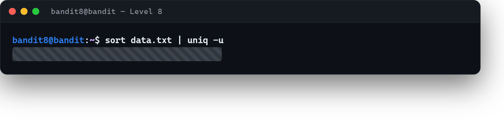

# 04 · Yalnız bir kez geçen satır

[Başlangıç](../README.md) · [Part 2 içindekiler](README.md)

**Hedef:** `bandit9`'un parolası `data.txt` içinde, **yalnızca bir kez geçen** tek satır. Diğer bütün satırlar tekrar ediyor. Bu kez aradığımız şeyin *içeriğini* değil, *kaç kez geçtiğini* biliyoruz — çözüm de buna göre kurulur.

## "Tek olanı" bulmak

Elimizde bir araç var: `uniq`, arka arkaya tekrar eden satırları teke indirir; `-u` seçeneğiyle ise **hiç tekrar etmeyen** satırları getirir. Ama bir şartı vardır: `uniq` yalnızca **yan yana** duran tekrarları görür. Tekrar eden satırlar dosyanın her yerine dağılmışsa, önce onları yan yana getirmemiz gerekir — bunu `sort` yapar.

İkisini bir boru (pipe) ile birleştiririz (Part 0 · [05 · Akışlar, pipe ve yönlendirme](../part-0/05-akislar-pipe-yonlendirme.md)):

```
$ sort data.txt | uniq -u
‹bandit9 parolası›
```

- `sort` bütün satırları sıralar → aynı satırlar art arda gelir.
- `uniq -u` art arda tekrarı olmayan, yani **eşsiz** satırı süzer.

Sonuç tek satır: aradığımız parola.



## Perde arkası

Buradaki asıl fikir, iki küçük aracı zincirleyerek tek başlarına yapamadıkları bir işi yaptırmak. `sort` "düzene sok", `uniq` "tekrarları ele"; pipe (`|`) ise birinin çıktısını ötekinin girdisine bağlar. Unix felsefesinin özü budur: her araç bir işi iyi yapar, gücü birleşmelerinden doğar. `sort | uniq` ikilisi, veri temizlemenin ve tekrar analizinin en klasik kalıbıdır.

> **Faydalı olabilir:** [Bandit Level 9](https://overthewire.org/wargames/bandit/bandit9.html).

## Part 2'nin sonunda

Beş adımda "aradığımı nasıl tarif ederim?" sorusunun farklı biçimlerini gördük: türe göre (`file`), boyut/izin/sahiplik koşullarına göre (`find`), içerdiği kelimeye göre (`grep`) ve tekrar sayısına göre (`sort | uniq`). Hepsinin ortak fikri aynı: kalabalığa tek tek bakmak yerine, koşulu araca söyleyip **süzdürmek.** Part 3'te veri artık düz durmayacak — kodlanmış ve sıkıştırılmış hâlleriyle uğraşacağız.

<!-- part2-altnav -->

---

← [03 · Kalabalıkta bir kelime](03-kalabalikta-bir-kelime.md) · [Part 2 içindekiler](README.md)
