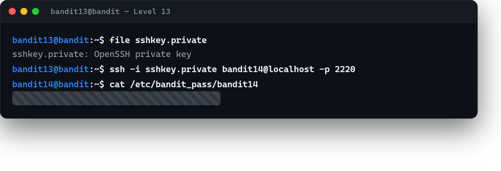

# 04 · Parola yerine anahtar

[Başlangıç](../README.md) · [Part 3 içindekiler](README.md)

**Hedef:** Bu adımda bir sonraki seviyenin **parolasını** almıyoruz; onun yerine bir **özel SSH anahtarı** (private key) buluyoruz ve `bandit14`'e bu anahtarla giriş yapıyoruz. `bandit14`'ün asıl parolası `/etc/bandit_pass/bandit14` dosyasında ama onu ancak `bandit14` kullanıcısı okuyabilir.

## Anahtarı bulmak

`bandit13` olarak ev dizinimize bakarız:

```
$ ls
sshkey.private
$ file sshkey.private
sshkey.private: OpenSSH private key
```

`sshkey.private` bir özel SSH anahtarı. Part 0'da SSH'ın parola dışında **anahtar çiftiyle** de kimlik doğrulayabildiğini görmüştük ([09 · SSH](../part-0/09-ssh.md)): sunucu senin açık anahtarını tanıyorsa, karşılık gelen özel anahtarı gösteren kişiyi parolasız içeri alır.

## Anahtarla giriş

Önceki seviyelerde bağlanırken kullandığımız `ssh` komutuna, parola yerine anahtar dosyasını `-i` (*identity*) ile veririz:

```
$ ssh -i sshkey.private bandit14@localhost -p 2220
```

- `-i sshkey.private` → kimlik olarak bu özel anahtarı kullan,
- `bandit14@localhost` → aynı sunucudaki `bandit14` kullanıcısı (zaten Bandit sunucusundayız, o yüzden `localhost`).

> **Not (izinler):** SSH, özel anahtar dosyasının başkalarınca okunabilir olmasına izin vermez; "unprotected private key" uyarısı alırsan `chmod 600 sshkey.private` ile izinleri daraltman gerekir (Part 0 · [07 · İzinler](../part-0/07-izinler.md)).

`bandit14` olarak giriş yaptıktan sonra artık kendi parola dosyamızı okuyabiliriz:

```
$ cat /etc/bandit_pass/bandit14
‹bandit14 parolası›
```



## Perde arkası

SSH anahtar tabanlı kimlik doğrulama, sunucu yönetiminde parolaların yerini alan standart yöntemdir: parola ağda hiç dolaşmaz, anahtar çalınmadıkça güvenlidir. Buradaki iki ders güvenlikte kritiktir: (1) sızılan bir sistemde bulunan bir özel anahtar, başka makinelere açılan bir kapıdır; (2) SSH'ın izinlere titizliği bir kapris değil, güvenlik önlemidir — herkesin okuyabildiği bir özel anahtar zaten güvensizdir.

> **Faydalı olabilir:** [Bandit Level 14](https://overthewire.org/wargames/bandit/bandit14.html).

<!-- part3-altnav -->

---

← [03 · Katman katman açmak](03-katman-katman-acmak.md) · [Part 3 içindekiler](README.md) · [05 · Ağ üzerinden parola](05-ag-uzerinden-parola.md) →
