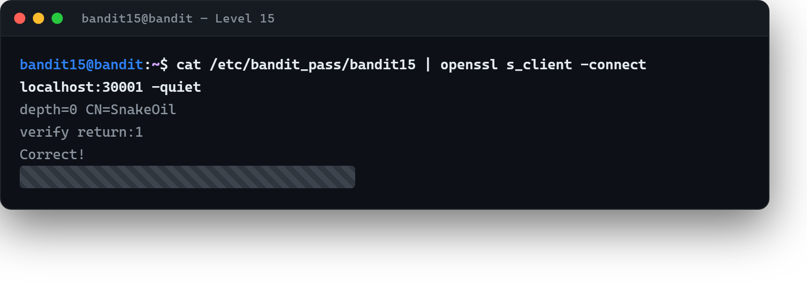

# 00 · Şifreli bağlantı

[Başlangıç](../README.md) · [Part 4 içindekiler](README.md)

**Hedef:** `bandit16`'nın parolasını yine bir porta parola göndererek alacağız, ama bu kez port **30001** ve bağlantı **SSL/TLS ile şifreli** olmalı. Part 3'te düz `nc` ile konuşmuştuk; burada araya bir şifreleme katmanı giriyor.

## Neden nc yetmiyor?

30001 portundaki servis, ham TCP değil **şifreli** konuşur. `nc` düz bağlantı kurar; şifreli bir servise düz veri göndermek işe yaramaz. İhtiyacımız olan, bağlantıyı TLS ile saran bir istemci: `openssl s_client`.

```
$ openssl s_client -connect localhost:30001
```

Bu, 30001'e şifreli bir bağlantı açar ve sertifika bilgilerini basar. Bağlantı kurulunca, tıpkı `nc`'deki gibi parolayı yazarız (ya da bir boru ile göndeririz):

```
$ cat /etc/bandit_pass/bandit15 | openssl s_client -connect localhost:30001 -quiet
...
Correct!
‹bandit16 parolası›
```

- `-connect localhost:30001` → şifreli bağlanılacak adres ve port,
- `-quiet` → sertifika ayrıntılarını kısar, yalnız veri akışını bırakır.

Servis parolayı doğrulayınca `Correct!` der ve `bandit16`'nın parolasını gönderir.



## Perde arkası

Bugün internetteki servislerin büyük çoğunluğu şifreli konuşur (HTTPS'in "S"si tam da budur). `openssl s_client`, bir TLS servisiyle **elle** konuşmanın standart aracıdır: sertifikayı incelemek, desteklenen protokolleri görmek ya da bu örnekteki gibi şifreli bir kanaldan veri alışverişi yapmak için. `nc`'nin yaptığını yapar, üstüne şifreleme katmanını ekler. "Servis düz mü, şifreli mi konuşuyor?" sorusu bir sonraki adımın tam merkezinde.

> **Faydalı olabilir:** [Bandit Level 16](https://overthewire.org/wargames/bandit/bandit16.html).

<!-- part4-altnav -->

---

[Part 4 içindekiler](README.md) · [01 · Doğru portu bulmak](01-dogru-portu-bulmak.md) →
