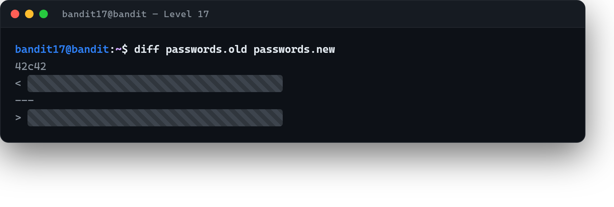

# 02 · İki dosyanın farkı

[Başlangıç](../README.md) · [Part 4 içindekiler](README.md)

**Hedef:** `bandit18`'in parolası, ev dizinindeki `passwords.new` dosyasında ve `passwords.old` ile arasında **değişen tek satır** o. İki büyük dosyayı gözle karşılaştırmak yerine, farkı bir araca buldururuz.

## Değişeni bulmak

Her iki dosyada da yüzlerce satır var; hangisinin değiştiğini bulmak için `diff` kullanırız — iki dosyayı satır satır karşılaştırıp yalnız **farkları** gösterir:

```
$ diff passwords.old passwords.new
42c42
< ‹eski satır›
---
> ‹bandit18 parolası›
```

Çıktının okunuşu:

- `42c42` → 42. satır **değişmiş** (*changed*),
- `<` ile başlayan satır **birinci** dosyadan (`passwords.old`),
- `>` ile başlayan satır **ikinci** dosyadan (`passwords.new`).

Bize gereken, `passwords.new`'daki yani `>` ile işaretli satır — aradığımız parola.



## Perde arkası

`diff`, iki metin arasındaki değişikliği bulmanın standart aracıdır ve çok geniş bir alanda karşına çıkar: bir yapılandırma dosyasının önce/sonra hâlini karşılaştırmaktan, sürüm kontrol sistemlerinin (Git gibi) çalışma temeline kadar. Buradaki fikir basit ama güçlü: "neyin değiştiğini" bulmak, çoğu zaman "her şeye tek tek bakmaktan" çok daha hızlı yol açar. İki durumun farkına odaklanmak, hata ayıklamadan güvenlik incelemesine kadar tekrar tekrar işine yarar.

> **Faydalı olabilir:** [Bandit Level 18](https://overthewire.org/wargames/bandit/bandit18.html).

<!-- part4-altnav -->

---

← [01 · Doğru portu bulmak](01-dogru-portu-bulmak.md) · [Part 4 içindekiler](README.md) · [03 · Girişte kapı yüzüne kapanınca](03-giriste-atilan-kabuk.md) →
