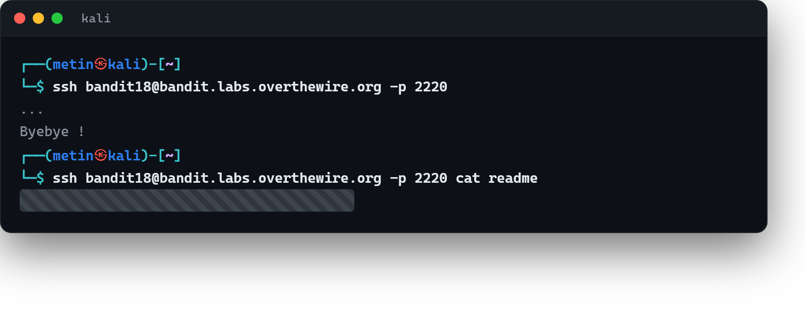

# 03 · Girişte kapı yüzüne kapanınca

[Başlangıç](../README.md) · [Part 4 içindekiler](README.md)

**Hedef:** `bandit19`'un parolası ev dizinindeki `readme` dosyasında. Ama bir sorun var: birileri `bandit18`'in `.bashrc` dosyasını değiştirmiş; SSH ile giriş yapar yapmaz oturum bizi **anında dışarı atıyor.** Dosyayı okumaya vaktimiz olmuyor.

## Sorunu görmek

Normalde bağlanırdık:

```
$ ssh bandit18@bandit.labs.overthewire.org -p 2220
...
Byebye !
```

Bağlanır bağlanmaz `Byebye !` yazıp çıkıyor. Çünkü `.bashrc` (giriş sırasında çalışan başlangıç betiği) sonuna bir `exit` eklenmiş. İnteraktif bir kabuk açamıyoruz.

## Çözüm — interaktif kabuğu atlamak

`ssh`, sonuna bir komut eklediğimizde interaktif kabuk **açmadan** o komutu çalıştırıp çıkar. Yani `.bashrc`'nin bizi atmasına fırsat vermeden, doğrudan istediğimiz komutu koştururuz:

```
$ ssh bandit18@bandit.labs.overthewire.org -p 2220 cat readme
...
‹bandit19 parolası›
```

Buradaki fark kritik: `ssh ... cat readme`, sunucuda etkileşimli bir oturum başlatmaz; sadece `cat readme`'yi çalıştırıp çıktısını bize gösterir ve kapanır. `.bashrc`'nin interaktif kabuğa eklediği `exit` devreye girmeden parolayı okumuş oluruz.



## Perde arkası

Buradaki ders, SSH'ın iki farklı çalışma biçimi olduğunu görmek: **interaktif** (bir kabuk açar, sen komut yazarsın) ve **komut çalıştırma** (verdiğin tek komutu koşturup çıkar). Bir giriş betiği (`.bashrc`, `.profile`) yolunu kesiyorsa, ikinci biçim onu baypas etmenin yoludur. Aynı fikir, betiklerde ve otomasyonda "uzak makinede tek bir komut çalıştır" derken de kullanılır — interaktif kabuğun yükü ve tuzakları olmadan.

> **Faydalı olabilir:** [Bandit Level 19](https://overthewire.org/wargames/bandit/bandit19.html).

<!-- part4-altnav -->

---

← [02 · İki dosyanın farkı](02-iki-dosyanin-farki.md) · [Part 4 içindekiler](README.md) · [04 · Bir başkası adına çalıştırmak](04-baskasi-adina-calistirmak.md) →
