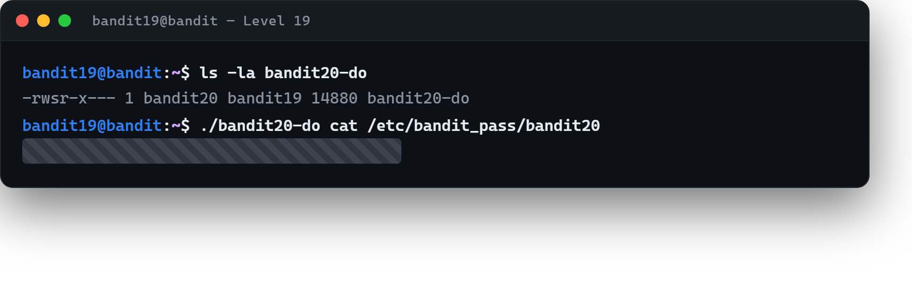

# 04 · Bir başkası adına çalıştırmak

[Başlangıç](../README.md) · [Part 4 içindekiler](README.md)

**Hedef:** `bandit20`'nin parolası her zamanki yerde — `/etc/bandit_pass/bandit20` — ama onu ancak `bandit20` kullanıcısı okuyabilir. Ev dizinimizde bir **setuid** ikili dosyası var; onu kullanarak parolayı okuyacağız.

## setuid nedir?

Ev dizinine bakarız:

```
$ ls -la bandit20-do
-rwsr-x--- 1 bandit20 bandit19 14880 ... bandit20-do
```

İzinlerdeki `s` harfine dikkat: bu, dosyanın **setuid** bit'i açık demektir. Normalde bir programı çalıştırdığında program **senin** yetkilerinle çalışır. Setuid bit'i açık bir program ise, çalıştıran kim olursa olsun **dosyanın sahibinin** (burada `bandit20`) yetkileriyle çalışır (Part 0 · [07 · İzinler](../part-0/07-izinler.md)).

## Programı kullanmak

Argümansız çalıştırınca ne işe yaradığını söyler:

```
$ ./bandit20-do
Run a command as another user.
  Example: ./bandit20-do whoami
```

Yani ona bir komut verirsek, o komutu `bandit20` kimliğiyle çalıştırır. `whoami` ile deneyip doğrularız, sonra parola dosyasını okuturuz:

```
$ ./bandit20-do whoami
bandit20
$ ./bandit20-do cat /etc/bandit_pass/bandit20
‹bandit20 parolası›
```

`bandit19` olduğumuz hâlde, `bandit20-do` sayesinde `bandit20`'nin okuyabildiği dosyayı okuduk.



## Perde arkası

Setuid, Linux'ta **yetki yükseltmenin** (privilege escalation) temel mekanizmalarından biridir — ve tam da bu yüzden güvenlikte iki yüzü vardır. Meşru kullanımı vardır (`passwd` komutu, parolanı değiştirmek için setuid'le root yetkisi kullanır). Ama kötü yazılmış bir setuid programı, saldırgana sahibinin (çoğu zaman root'un) yetkilerini açan bir kapıya dönüşür. Bir sistemi incelerken "hangi setuid programları var ve ne yapıyor?" sorusu, yetki yükseltme avının ilk adımıdır. Sonraki seviyede tam da böyle bir programın **kötü tasarımını** kullanacağız.

> **Faydalı olabilir:** [Bandit Level 20](https://overthewire.org/wargames/bandit/bandit20.html).

<!-- part4-altnav -->

---

← [03 · Girişte kapı yüzüne kapanınca](03-giriste-atilan-kabuk.md) · [Part 4 içindekiler](README.md) · [05 · Kendi servisine bağlanmak](05-kendi-servisine-baglanmak.md) →
