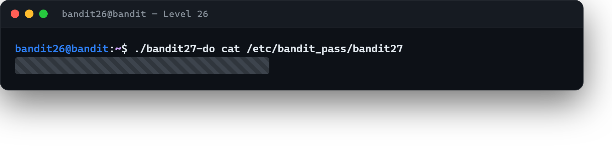

# 05 · Kabuktan sonra son parola

[Başlangıç](../README.md) · [Part 5 içindekiler](README.md)

**Hedef:** Bir önceki adımda `bandit26` olarak gerçek bir kabuk elde ettik. Şimdi `bandit27`'nin parolasını alacağız — ve yöntem tanıdık: ev dizinindeki bir **setuid** program.

## Tanıdık araç

`bandit26`'nın ev dizininde, Part 4'te gördüğümüz `bandit20-do`'nun kardeşi olan bir program var:

```
$ ls
bandit27-do  text.txt
$ ./bandit27-do
Run a command as another user.
  Example: ./bandit27-do whoami
```

Tıpkı `bandit20-do` gibi, `bandit27-do` da verdiğimiz komutu **`bandit27` kimliğiyle** çalıştıran bir setuid programı. Öyleyse `bandit27`'nin parola dosyasını ona okuturuz:

```
$ ./bandit27-do cat /etc/bandit_pass/bandit27
‹bandit27 parolası›
```



## Perde arkası

Bu iki adım birlikte güzel bir örüntü oluşturur: önce kısıtlı kabuktan **kaçış** (Part 5 · 04), sonra elde edilen kabukta bir setuid programıyla **yetki yükseltme**. Gerçek saldırılar da çoğu zaman böyle zincirlenir — tek bir sihirli komut değil, birbirini besleyen küçük adımlar: bir yere gir, oradan biraz daha yetki al, o yetkiyle bir sonraki kapıyı aç. `bandit20-do`'yu bir kez anladıysan, `bandit27-do` sürpriz değil; aynı kavramın tekrarı, bilerek koyulmuş bir pekiştirme.

> **Faydalı olabilir:** [Bandit Level 27](https://overthewire.org/wargames/bandit/bandit27.html).

## Part 5'in sonunda

Bu part'ta sistemin "arka planını" kurcaladık: zamanlanmış görevleri okuyup (`cron`, `/etc/cron.d/`) ne yaptıklarını çözdük, betiklerin ürettiği dosya adlarını yeniden hesapladık, ilk kez **kendi betiğimizi** başka bir kimliğe koşturttuk, dört haneli bir pini kaba kuvvetle kırdık ve kısıtlı bir kabuktan `vi` ile kaçtık. Ortak tema: bir sistemin otomatik davranışlarını okumak ve onların bıraktığı açıkları kullanmak. Son part'ta bambaşka bir araca — **Git**'e — ve son bir kaçışa geçiyoruz.

<!-- part5-altnav -->

---

← [04 · Kısıtlı kabuktan kaçış](04-kisitli-kabuktan-kacis.md) · [Part 5 içindekiler](README.md)
