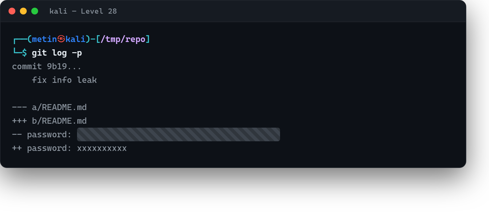

# 01 · Geçmişe bakmak

[Başlangıç](../README.md) · [Part 6 içindekiler](README.md)

**Hedef:** `bandit29`'un parolası `bandit28-git` deposunda. Ama bu kez deponun **son hâline** bakınca parola yerinde yok — birileri onu "temizlemiş". Neyse ki Git hiçbir şeyi gerçekten unutmaz: parola **geçmişte** duruyor.

## Son hâlde parola yok

Depoyu klonlayıp içeriğe bakarız:

```
$ git clone ssh://bandit28-git@bandit.labs.overthewire.org:2220/home/bandit28-git/repo
$ cd repo
$ cat README.md
# Bandit Notes
...
- username: bandit29
- password: xxxxxxxxxx
```

Parola `xxxxxxxxxx` ile değiştirilmiş. Ama Git'te her değişiklik bir **commit** olarak kayıtlıdır; eski hâller silinmez, tarihçede kalır.

## Geçmişi açmak

`git log` deponun commit tarihçesini gösterir; `-p` seçeneği her commit'in **ne değiştirdiğini** (diff) de basar:

```
$ git log -p
commit ...
    fix info leak
--- a/README.md
+++ b/README.md
- password: ‹bandit29 parolası›
+ password: xxxxxxxxxx
```

"fix info leak" (bilgi sızıntısını düzelt) başlıklı commit tam da aradığımızı ele verir: parolayı `xxxxxxxxxx` ile değiştirmiş. Diff'te `-` ile başlayan satır, **silinmeden önceki** hâldir — yani gerçek parola orada.



## Perde arkası

Buradaki ders, güvenlikte çok pahalıya patlayan bir gerçektir: **Git bir şeyi geçmişten silmek, onu yok etmez.** Bir parolayı, API anahtarını ya da gizli bir dosyayı yanlışlıkla depoya ekleyip sonra "silen" bir commit atmak, sırrı korumaz — tarihçeye bakan herkes onu görür. Gerçek dünyada sızan sayısız kimlik bilgisi tam olarak böyle bulunur: `git log` ile geçmişi taramak. Bir depoyu incelerken son hâle bakmak yetmez; tarihçe asıl hikâyeyi anlatır.

> **Faydalı olabilir:** [Bandit Level 29](https://overthewire.org/wargames/bandit/bandit29.html).

<!-- part6-altnav -->

---

← [00 · Uzak depoyu klonlamak](00-uzak-depoyu-klonlamak.md) · [Part 6 içindekiler](README.md) · [02 · Dallar arasında](02-dallar-arasinda.md) →
