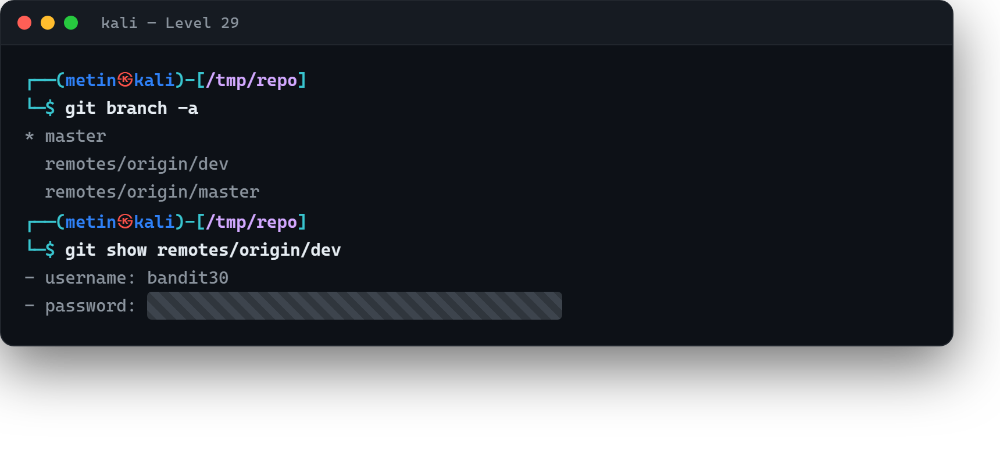

# 02 · Dallar arasında

[Başlangıç](../README.md) · [Part 6 içindekiler](README.md)

**Hedef:** `bandit30`'un parolası `bandit29-git` deposunda. Ana dalın (main) `README.md`'sinde parola yok — yerinde `<no passwords in production!>` (üretimde parola olmaz!) yazıyor. Parola başka bir **dalda** (branch) saklı.

## Dallar nedir, hangileri var?

Git'te bir depo tek bir çizgi olmak zorunda değil; **dallar** paralel geliştirme çizgileridir (örneğin `dev`, `test`, `main`). Ana dalda bir şey yoksa, öteki dallara bakmalıyız. Tüm dalları — yereldekiler ve uzaktakiler dahil — `git branch -a` listeler:

```
$ git clone ssh://bandit29-git@bandit.labs.overthewire.org:2220/home/bandit29-git/repo
$ cd repo
$ git branch -a
* master
  remotes/origin/dev
  remotes/origin/master
  ...
```

`dev` adında bir uzak dal var. İçeriğine `git show` ile bakarız (dal adı yeterli):

```
$ git show remotes/origin/dev
...
- username: bandit30
- password: ‹bandit30 parolası›
```

`dev` dalının `README.md`'sinde, ana dalda gizlenen parola açıkça duruyor. Dala geçmek istersek `git checkout dev` de yapabilirdik.



## Perde arkası

Buradaki ders şu: bir deponun "gösterdiği" tek bir dal olabilir ama **hepsi orada.** Geliştiriciler çoğu zaman deneme, geliştirme ya da eski çalışmaları ayrı dallarda tutar; bunlar üretim dalında görünmese de klonladığında hepsi sana gelir. Güvenlik incelemesinde `git branch -a` refleks olmalı — çünkü bir sır ana dalda temizlenmiş olsa bile unutulmuş bir `dev` ya da `feature` dalında durabilir. "Ana dalda yoksa, diğer dallara bak" kuralı bir öncekinin (geçmişe bak) kardeşidir.

> **Faydalı olabilir:** [Bandit Level 30](https://overthewire.org/wargames/bandit/bandit30.html).

<!-- part6-altnav -->

---

← [01 · Geçmişe bakmak](01-gecmise-bakmak.md) · [Part 6 içindekiler](README.md) · [03 · Etiketlerde saklı](03-etiketlerde-sakli.md) →
