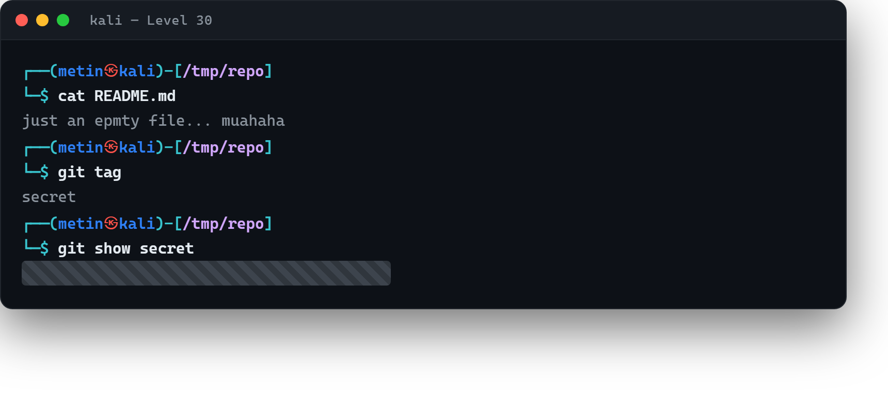

# 03 · Etiketlerde saklı

[Başlangıç](../README.md) · [Part 6 içindekiler](README.md)

**Hedef:** `bandit31`'in parolası `bandit30-git` deposunda. Bu kez ne dosyalarda, ne geçmişte, ne dallarda — `README.md` bomboş (`just an epmty file... muahaha`). Parola bir Git **etiketinde** (tag) saklı.

## Etiketleri listelemek

Etiketler, Git'te belirli bir commit'e verilen kalıcı adlardır (genelde sürüm işaretlemek için: `v1.0` gibi). Depoda hangi etiketler var, `git tag` ile bakarız:

```
$ git clone ssh://bandit30-git@bandit.labs.overthewire.org:2220/home/bandit30-git/repo
$ cd repo
$ cat README.md
just an epmty file... muahaha
$ git tag
secret
```

`secret` adında bir etiket var. İçeriğine yine `git show` ile bakarız:

```
$ git show secret
‹bandit31 parolası›
```

Etiketin işaret ettiği içerikte parola açıkça duruyor.



## Perde arkası

Bu adım, Part 6'nın büyük dersini tamamlar: bir Git deposunda bilgi **birçok yerde** saklı olabilir — çalışma ağacında (dosyalar), geçmişte (commit'ler), dallarda (branch) ve etiketlerde (tag). Deponun görünen yüzü boşsa bile bunlardan biri dolu olabilir. Bir depoyu tam olarak incelemek demek, dördüne birden bakmak demektir: `ls`/`cat`, `git log`, `git branch -a`, `git tag`. "Boş görünüyor" ile "boş" arasındaki farkı Part 1'de gizli dosyalarla öğrenmiştik; Git'te de aynı fikir geçerli, sadece saklanacak köşe daha çok.

> **Faydalı olabilir:** [Bandit Level 31](https://overthewire.org/wargames/bandit/bandit31.html).

<!-- part6-altnav -->

---

← [02 · Dallar arasında](02-dallar-arasinda.md) · [Part 6 içindekiler](README.md) · [04 · Depoya dosya itmek](04-depoya-dosya-itmek.md) →
