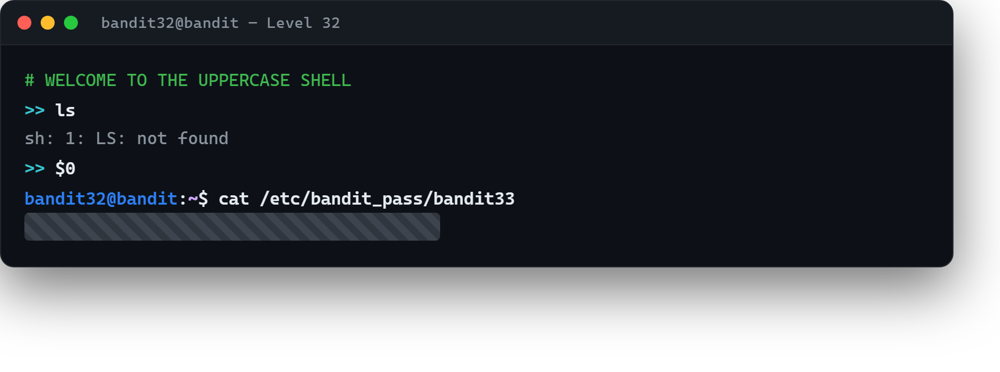

# 05 · Büyük harfe çeviren kabuk

[Başlangıç](../README.md) · [Part 6 içindekiler](README.md)

**Hedef:** `bandit33`'ün parolası — serinin son adımı. `bandit32` olarak giriş yapınca tuhaf bir kabuğa düşeriz: yazdığımız her şeyi **büyük harfe** çevirip öyle çalıştırıyor. Linux komutları küçük harf olduğundan (`ls`, `cat`…), büyük harfe çevrilenler (`LS`, `CAT`) "command not found" verir. Bir kez daha bir kabuktan kaçmamız gerek.

## Sorunu görmek

Giriş yapınca bir karşılama ve `>>` istemi çıkar:

```
WELCOME TO THE UPPERCASE SHELL
>> ls
sh: 1: LS: not found
>> whoami
sh: 1: WHOAMI: not found
```

Yazdığımız `ls`, `LS` olarak çalıştırılıyor ve bulunamıyor. Büyük harfe çevrilince bozulmayan bir şeye ihtiyacımız var.

## Harf içermeyen bir hamle: `$0`

Kabuk yalnız **harfleri** büyütür; rakamları ve özel karakterleri olduğu gibi bırakır. `$0` tam da böyle bir ifadedir: harf içermez, dolayısıyla dokunulmadan geçer. Peki ne işe yarar? `$0`, kabukta **çalışan programın kendi adıdır** — yani mevcut kabuğun kendisi. Onu çalıştırırsak, büyük-harf katmanının altında yeni, **normal** bir kabuk açılır:

```
>> $0
$ whoami
bandit32
$ cat /etc/bandit_pass/bandit33
‹bandit33 parolası›
```

`$0`'ı çalıştırınca istem `>>`'ten normal `$`'a döner: artık büyük harfe çevrilmeyen gerçek bir kabuktayız. Parolayı okuruz.



## Perde arkası

Bu, serinin ikinci kısıtlı-kabuk kaçışı ve belki en zarifi. Fikir şu: bir filtre (burada "büyük harfe çevir") yalnız belirli girdileri bozuyorsa, o filtreden **bozulmadan geçen** bir ifade ararsın. `$0` harf içermediği için filtreyi atlar, üstelik doğrudan yeni bir kabuk açar. Bu tür "girdi dönüşümünü atlatma" düşüncesi, güvenliğin merkezindedir — bir sistemin girdiyi nasıl işlediğini anlayıp, o işlemenin dokunmadığı bir yol bulmak. Part 1'deki "komut bu metni nasıl yorumluyor?" sorusunun en ileri hâli budur.

> **Faydalı olabilir:** [Bandit Level 32](https://overthewire.org/wargames/bandit/bandit32.html).

## Serinin sonunda

`bandit33`'e ulaştın — ve OverTheWire'ın deyişiyle, bu noktada "henüz bir Level 34 yok." Otuz dört adımda sıfırdan başlayıp; dosya okumaktan port taramaya, kodlama çözmekten yetki yükseltmeye, cron'dan Git'e ve kısıtlı kabuk kaçışlarına kadar geçtin. Ama asıl kazanılan şey komut listesi değil; her seferinde tekrarlanan o düşünme biçimi: **"elimde ne var, bu nasıl çalışıyor, ben bunu nasıl açarım?"** Parolalar unutulur; bu soru kalır.

Devam etmek istersen OverTheWire'ın diğer oyunları (Natas, Leviathan, Krypton…) bir sonraki durak. Ama önce: tebrikler.

<!-- part6-altnav -->

---

← [04 · Depoya dosya itmek](04-depoya-dosya-itmek.md) · [Part 6 içindekiler](README.md)
